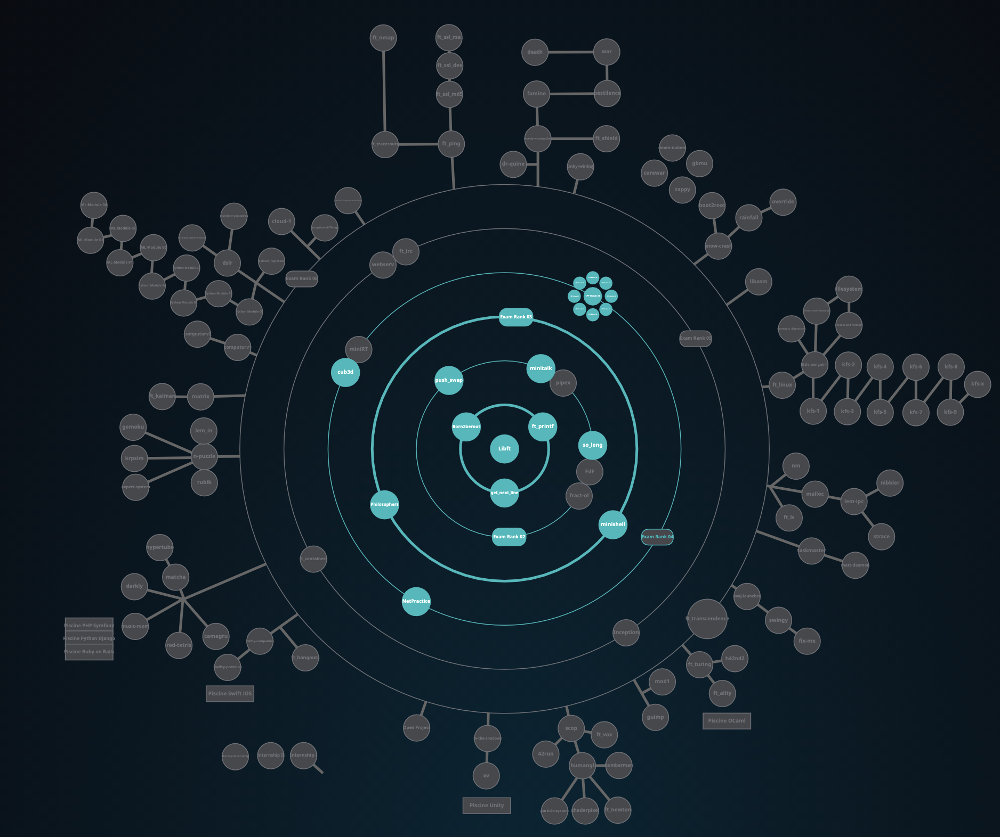

# 1337 - 42 NETWORK

## HolyGraph

## INFO
***CLASS OF 01/11/2021 (4th promo)***

## PROJECTS

### COMMON CORE
(***! to see the subjects click on the status***)

(***! some projects can't be uploaded due to there nature [virtual machine - networking - ... ]***)

(***! some projects only has 100 as max score***)

(***! plz use the evaluation pdfs as reference only since they are bound change with time***)

| CIRCLE  | NAME | FIELD | EXPECTED DURATION | EXP | STATUS | LVL |
| :-: | :-: | :-: | :-: | :-: | :-: | :-: |
| 0 | [libft](./C/libft) | C | 70 hours | 462 |  | 1.06 |
| 1 | [get next line](./C/get_next_line) | C | 70 hours | 882 |  | 1.57 |
| 1 | [ft_printf](./C/ft_printf) | C | 175 hours | 882 |  | 2.05 |
| 1 | Born2beRoot | Virtual Machine | 40 hours | 577 |  | 2.28 |
| 1 | Exam Rank 02 | C | 2 hours | 0 |  | 2.28 |
| 2 | [push_swap](./C/push_swap) | C | 60 hours | 1855 |  | 3.02 |
| 2 | [so_long](./C/so_long) | C - mlx | 60 hours | 1000 |  | 3.24 |
| 2 | [minitalk](./C/minitalk) | C | 50 hours | 1142 |  | 3.49 |
| 2 | Exam Rank 03 | C | 2 hours | 0 |  | 3.49 |
| 3 | [Philosophers](./C/philosophers) | C | 70 hours | 3360 |  | 4.08 |
| 3 | [minishell](./C/minishell) | C | 210 hours | 2814 |  | 4.29 |
| 4 | NetPractice | Networking | 50 hours | 3160 |  | 4.47 |
| 4 | [cub3d](./C/cub3d) | C - mlx | 280 hours | 5775 |  | 4.91 |
| 4 | [CPP Module 00](./cpp/Module00) | CPP | 7 hours | 0 |  | 4.91 |
| 4 | [ CPP Module 01](./cpp/Module01) | CPP | 7 hours | 0 |  | 4.91 |
| 4 | [CPP Module 02](./cpp/Module02) | CPP | 7 hours | 0 |  | 4.91 |
| 4 | [CPP Module 03](./cpp/Module03) | CPP | 7 hours | 0 |  | 4.91 |